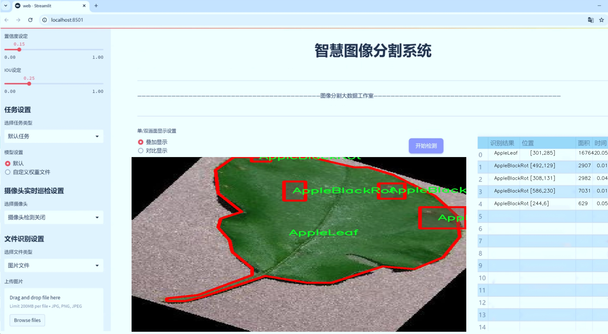
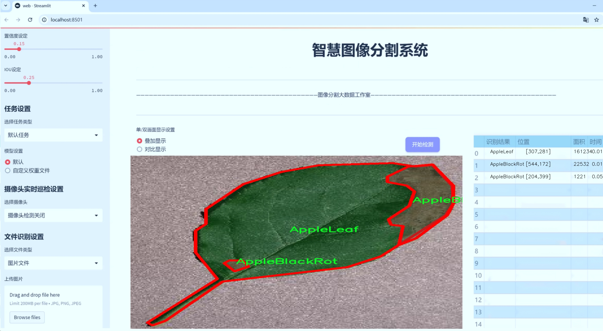
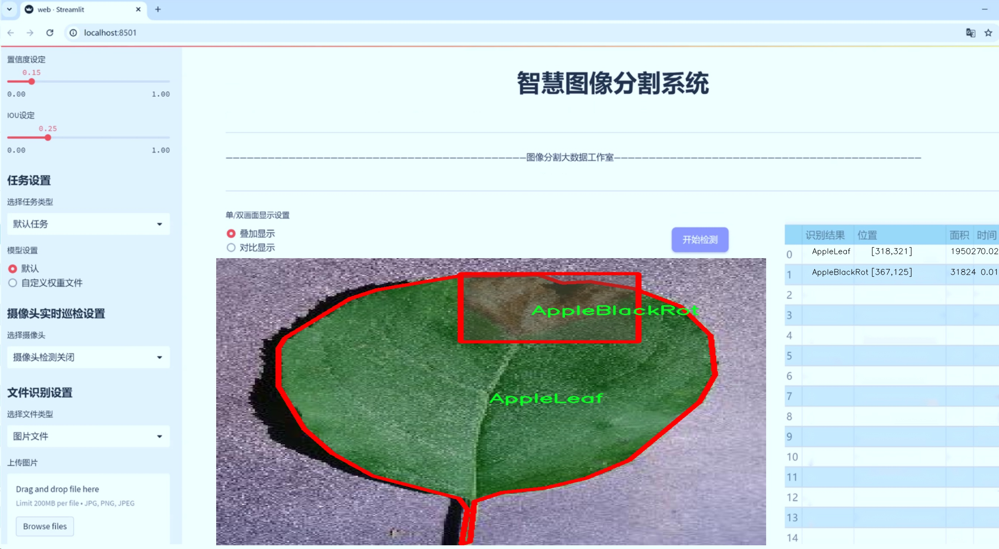
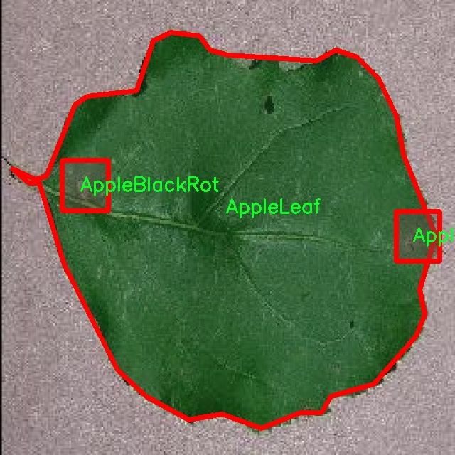
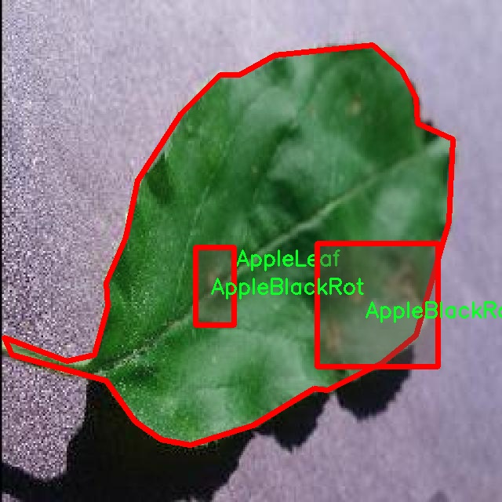
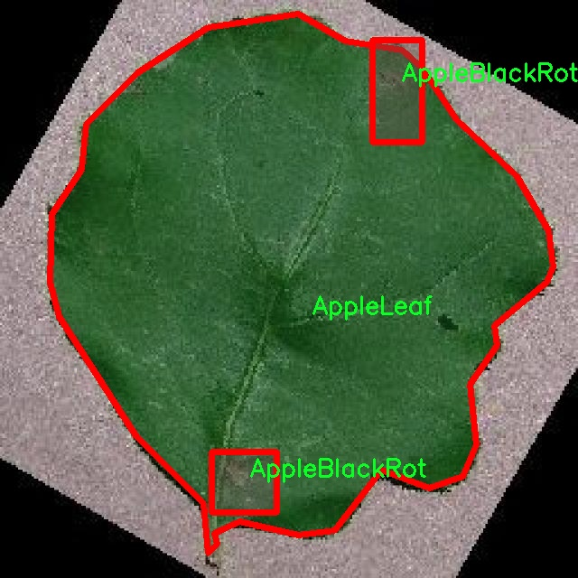
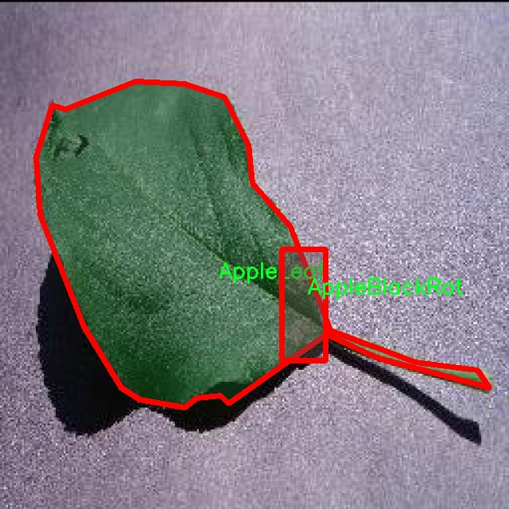
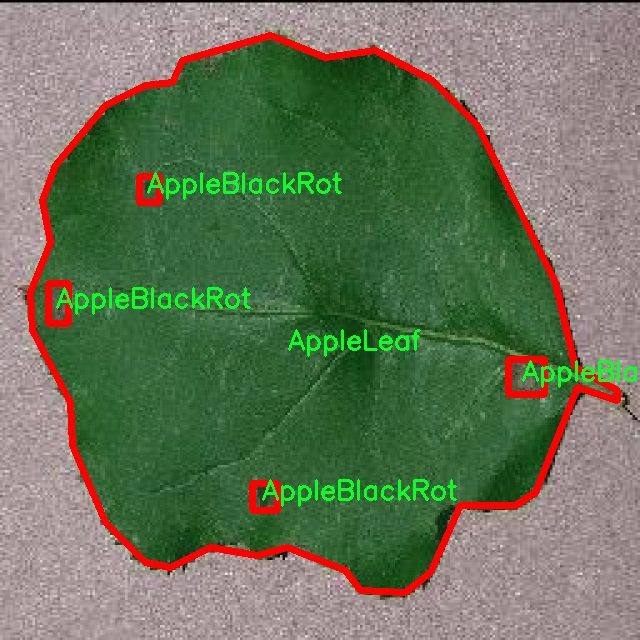

# 苹果病害图像分割系统： yolov8-seg-EfficientRepBiPAN

### 1.研究背景与意义

[参考博客](https://gitee.com/YOLOv8_YOLOv11_Segmentation_Studio/projects)

[博客来源](https://kdocs.cn/l/cszuIiCKVNis)

研究背景与意义

随着全球农业生产的现代化进程加快，果树种植业在提高产量和质量方面面临着前所未有的挑战。苹果作为全球最重要的水果之一，其种植面积和产量在近年来持续增长。然而，苹果树在生长过程中容易受到多种病害的侵袭，如苹果黑腐病、苹果雪松锈病、苹果叶病和苹果斑点病等。这些病害不仅影响苹果的生长和发育，还可能导致严重的经济损失。因此，及时、准确地识别和诊断苹果病害，成为保障苹果产业可持续发展的重要环节。

传统的病害识别方法主要依赖于人工观察和经验判断，然而这种方法不仅耗时耗力，而且容易受到主观因素的影响，导致识别结果的不准确。随着计算机视觉和深度学习技术的快速发展，基于图像处理的病害识别方法逐渐成为研究的热点。YOLO（You Only Look Once）系列模型因其高效的实时目标检测能力，已被广泛应用于农业病害识别领域。YOLOv8作为该系列的最新版本，具有更高的检测精度和更快的处理速度，为苹果病害的自动识别提供了新的技术支持。

本研究旨在基于改进的YOLOv8模型，构建一个高效的苹果病害图像分割系统。通过对2200张包含四类苹果病害（苹果黑腐病、苹果雪松锈病、苹果叶病和苹果斑点病）的图像进行训练和测试，系统能够实现对不同病害的准确分割和识别。数据集的多样性和丰富性为模型的训练提供了良好的基础，使得系统能够在实际应用中具备较强的泛化能力。

本研究的意义在于，不仅能够提高苹果病害的识别效率和准确性，还能够为果农提供科学的决策支持。通过实时监测和早期诊断，果农可以及时采取相应的防治措施，降低病害对苹果产量和质量的影响。此外，基于深度学习的图像分割技术还可以为其他果树病害的研究提供借鉴，推动农业智能化的发展。

综上所述，基于改进YOLOv8的苹果病害图像分割系统的研究，不仅具有重要的理论价值，还有着广泛的实际应用前景。通过这一系统的开发与应用，能够有效提升苹果产业的管理水平和生产效率，为实现农业可持续发展贡献力量。

### 2.图片演示







注意：本项目提供完整的训练源码数据集和训练教程,由于此博客编辑较早,暂不提供权重文件（best.pt）,需要按照6.训练教程进行训练后实现上图效果。

### 3.视频演示

[3.1 视频演示](https://www.bilibili.com/video/BV1bWUmYkE7a/)

### 4.数据集信息

##### 4.1 数据集类别数＆类别名

nc: 4
names: ['AppleBlackRot', 'AppleCedarRust', 'AppleLeaf', 'AppleScab']


##### 4.2 数据集信息简介

数据集信息展示

在现代农业生产中，苹果病害的及时识别与处理对于提高果品质量和产量至关重要。为此，我们构建了一个专门用于训练改进YOLOv8-seg的苹果病害图像分割系统的数据集，命名为“Apple diseases”。该数据集旨在为苹果病害的自动检测与分类提供丰富的图像样本，助力智能农业的发展。

“Apple diseases”数据集包含四个主要类别，分别是Apple Black Rot、Apple Cedar Rust、Apple Leaf和Apple Scab。这四种病害是影响苹果树生长和果实质量的常见病害，每种病害都有其独特的症状和影响。Apple Black Rot主要表现为果实表面出现黑色腐烂斑点，严重时可导致果实完全腐烂；Apple Cedar Rust则以果叶上出现橙色斑点为特征，严重影响光合作用；Apple Leaf则是指苹果树叶片的病变，通常表现为黄化和枯萎；而Apple Scab则是由真菌引起的病害，表现为叶片和果实上出现黑色斑点，影响果实的外观和品质。

该数据集不仅涵盖了丰富的图像样本，还注重图像的多样性和真实性，确保涵盖不同生长阶段、不同环境条件下的苹果树病害表现。每个类别的图像均经过精心挑选和标注，确保其在训练模型时的有效性和准确性。数据集中包含的图像数量和质量，使得模型能够在多种情况下进行有效的学习和推理，从而提高其在实际应用中的鲁棒性。

在数据集的构建过程中，我们采用了多种数据增强技术，以增加模型的泛化能力。这些技术包括旋转、缩放、裁剪、颜色变换等，旨在模拟不同的拍摄条件和视角，使得模型能够更好地适应实际应用场景。此外，数据集中的图像还经过了严格的质量控制，确保每张图像的清晰度和标注的准确性，以便为后续的深度学习训练提供可靠的基础。

通过使用“Apple diseases”数据集，我们期望能够显著提升YOLOv8-seg在苹果病害图像分割任务中的表现。该数据集的构建不仅为研究人员和开发者提供了一个高质量的训练资源，也为苹果病害的智能识别和管理提供了重要的支持。随着深度学习技术的不断进步，基于该数据集训练出的模型将能够在实际农业生产中发挥重要作用，帮助农民及时发现和处理病害，减少损失，提高苹果的产量和质量。

总之，“Apple diseases”数据集的构建和应用，将为苹果病害的智能检测提供强有力的技术支持，推动农业智能化的发展，助力实现可持续的农业生产模式。











### 5.项目依赖环境部署教程（零基础手把手教学）

[5.1 环境部署教程链接（零基础手把手教学）](https://www.bilibili.com/video/BV1jG4Ve4E9t/?vd_source=bc9aec86d164b67a7004b996143742dc)


[5.2 安装Python虚拟环境创建和依赖库安装视频教程链接（零基础手把手教学）](https://www.bilibili.com/video/BV1nA4VeYEze/?vd_source=bc9aec86d164b67a7004b996143742dc)

### 6.手把手YOLOV8-seg训练视频教程（零基础手把手教学）

[6.1 手把手YOLOV8-seg训练视频教程（零基础小白有手就能学会）](https://www.bilibili.com/video/BV1cA4VeYETe/?vd_source=bc9aec86d164b67a7004b996143742dc)


按照上面的训练视频教程链接加载项目提供的数据集，运行train.py即可开始训练



     Epoch   gpu_mem       box       obj       cls    labels  img_size
     1/200     0G   0.01576   0.01955  0.007536        22      1280: 100%|██████████| 849/849 [14:42<00:00,  1.04s/it]
               Class     Images     Labels          P          R     mAP@.5 mAP@.5:.95: 100%|██████████| 213/213 [01:14<00:00,  2.87it/s]
                 all       3395      17314      0.994      0.957      0.0957      0.0843

     Epoch   gpu_mem       box       obj       cls    labels  img_size
     2/200     0G   0.01578   0.01923  0.007006        22      1280: 100%|██████████| 849/849 [14:44<00:00,  1.04s/it]
               Class     Images     Labels          P          R     mAP@.5 mAP@.5:.95: 100%|██████████| 213/213 [01:12<00:00,  2.95it/s]
                 all       3395      17314      0.996      0.956      0.0957      0.0845

     Epoch   gpu_mem       box       obj       cls    labels  img_size
     3/200     0G   0.01561    0.0191  0.006895        27      1280: 100%|██████████| 849/849 [10:56<00:00,  1.29it/s]
               Class     Images     Labels          P          R     mAP@.5 mAP@.5:.95: 100%|███████   | 187/213 [00:52<00:00,  4.04it/s]
                 all       3395      17314      0.996      0.957      0.0957      0.0845


### 7.50+种全套YOLOV8-seg创新点加载调参实验视频教程（一键加载写好的改进模型的配置文件）

[7.1 50+种全套YOLOV8-seg创新点加载调参实验视频教程（一键加载写好的改进模型的配置文件）](https://www.bilibili.com/video/BV1Hw4VePEXv/?vd_source=bc9aec86d164b67a7004b996143742dc)

### YOLOV8-seg算法简介

原始YOLOv8-seg算法原理

YOLOv8-seg算法是YOLO系列模型的最新版本之一，旨在实现高效的目标检测与分割任务。自2015年YOLO模型首次提出以来，YOLO系列经历了多次迭代和优化，至今已发展至第八个版本。YOLOv8不仅在推理速度和检测精度上实现了显著提升，还在训练和调整的便利性、硬件兼容性以及对自定义数据集的原生支持等方面表现出色，成为当前业界最受欢迎的目标检测算法之一。

YOLOv8的网络结构由三部分组成：Backbone（骨干网络）、Neck（颈部结构）和Head（头部结构）。Backbone负责从输入图像中提取特征，通常采用深度卷积神经网络以获取丰富的特征信息。Neck则负责对提取的特征进行融合，以便更好地捕捉不同尺度的信息。最后，Head部分通过解耦的方式输出检测结果，具体包括目标的类别、位置以及分割信息。YOLOv8-seg在这一基础上，进一步扩展了目标分割的能力，使得算法不仅能够识别目标，还能精确地分割出目标的轮廓。

在YOLOv8的设计中，深度因子（depth_factor）、宽度因子（width_factor）和通道数比率（ratio）是关键的超参数。这些参数的设置直接影响到模型的深度和宽度，进而影响到模型的表达能力和计算效率。通过调整这些参数，用户可以根据具体的应用需求，灵活地配置模型的结构。例如，较大的depth_factor和width_factor会使得网络变得更深、更宽，从而增强其特征提取能力，但同时也会增加计算负担；反之，较小的参数则会使得网络变得轻量化，适合在资源受限的环境中运行。

YOLOv8-seg在特征融合层采用了特征金字塔网络（FPN）和路径聚合网络（PAN），以提高对不同尺度特征的提取能力。FPN通过构建金字塔结构，使得模型能够在多个尺度上进行特征提取，从而有效应对目标大小变化带来的挑战。而PAN则通过增强特征传递，进一步提升了模型对上下文信息的理解能力。这种特征融合策略使得YOLOv8-seg在处理复杂场景时，能够更好地捕捉目标的细节信息。

在检测头层，YOLOv8-seg采用了轻量化的解耦头结构，这一设计的核心在于将目标检测与分割任务进行解耦，使得模型能够独立地处理每个任务。这种解耦设计不仅提高了模型的灵活性，还显著提升了分割的精度。与传统的耦合头结构相比，解耦头能够更有效地利用特征信息，从而在目标检测和分割任务中实现更高的性能。

YOLOv8-seg的另一个重要创新是引入了BiFPN（Bidirectional Feature Pyramid Network）网络。BiFPN通过高效的双向跨尺度连接，增强了特征的融合能力，使得模型在处理不同尺度的特征时，能够更加灵活和高效。通过对特征进行加权融合，BiFPN不仅提高了模型的性能，还加快了特征提取的速度。这一创新使得YOLOv8-seg在实时应用中表现出色，能够满足对速度和精度的双重需求。

此外，YOLOv8-seg还采用了多尺度训练和测试策略，以进一步提升模型的鲁棒性。在训练过程中，模型会在不同尺度的图像上进行训练，从而增强其对尺度变化的适应能力。在测试阶段，模型同样会在多个尺度上进行推理，以确保在各种场景下都能保持高效的检测和分割性能。这种多尺度策略使得YOLOv8-seg在实际应用中能够更好地应对复杂的环境变化。

综上所述，YOLOv8-seg算法通过一系列创新设计，成功地将目标检测与分割任务结合在一起，形成了一种高效、精确的解决方案。其独特的网络结构、灵活的参数设置、先进的特征融合策略以及多尺度训练和测试方法，使得YOLOv8-seg在各种应用场景中展现出强大的能力。无论是在智能监控、自动驾驶还是人脸识别等领域，YOLOv8-seg都能够提供卓越的性能，成为目标检测与分割领域的重要工具。随着YOLOv8-seg的不断发展和优化，未来在更广泛的应用场景中，其潜力将得到进一步的挖掘和实现。


### 9.系统功能展示（检测对象为举例，实际内容以本项目数据集为准）

图9.1.系统支持检测结果表格显示

  图9.2.系统支持置信度和IOU阈值手动调节

  图9.3.系统支持自定义加载权重文件best.pt(需要你通过步骤5中训练获得)

  图9.4.系统支持摄像头实时识别

  图9.5.系统支持图片识别

  图9.6.系统支持视频识别

  图9.7.系统支持识别结果文件自动保存

  图9.8.系统支持Excel导出检测结果数据


### 10.50+种全套YOLOV8-seg创新点原理讲解（非科班也可以轻松写刊发刊，V11版本正在科研待更新）

#### 10.1 由于篇幅限制，每个创新点的具体原理讲解就不一一展开，具体见下列网址中的创新点对应子项目的技术原理博客网址【Blog】：


[10.1 50+种全套YOLOV8-seg创新点原理讲解链接](https://gitee.com/qunmasj/good)

#### 10.2 部分改进模块原理讲解(完整的改进原理见上图和技术博客链接)【如果此小节的图加载失败可以通过CSDN或者Github搜索该博客的标题访问原始博客，原始博客图片显示正常】

### YOLOv8简介


由上图可以看出，C2中每个BottlNeck的输入Tensor的通道数channel都只是上一级的0.5倍，因此计算量明显降低。从另一方面讲，梯度流的增加，t也能够明显提升收敛速度和收敛效果。
C2i模块首先以输入tensor(n.c.h.w)经过Conv1层进行split拆分，分成两部分(n,0.5c,h,w)，一部分直接经过n个Bottlenck，另一部分经过每一操作层后都会以(n.0.5c,h,w)的尺寸进行Shortcut，最后通过Conv2层卷积输出。也就是对应n+2的Shortcut(第一层Conv1的分支tensor和split后的tensor为2+n个bottenlenneck)。
#### Neck
YOLOv8的Neck采用了PANet结构，如下图所示。

Backbone最后SPPF模块(Layer9)之后H、W经过32倍下采样，对应地Layer4经过8倍下采样，Layer6经过16倍下采样。输入图片分辨率为640*640，得到Layer4、Layer6、Layer9的分辨率分别为80*80、40*40和20*20。
Layer4、Layer6、Layer9作为PANet结构的输入，经过上采样，通道融合，最终将PANet的三个输出分支送入到Detect head中进行Loss的计算或结果解算。
与FPN(单向，自上而下)不同的是，PANet是一个双向通路网络，引入了自下向上的路径，使得底层信息更容易传递到顶层。
#### Head
Head部分相比Yolov5改动较大，直接将耦合头改为类似Yolo的解耦头结构(Decoupled-Head)，将回归分支和预测分支分离，并针对回归分支使用了Distribution Focal Loss策略中提出的积分形式表示法。之前的目标检测网络将回归坐标作为一个确定性单值进行预测，DFL将坐标转变成一个分布。


### LSKNet的架构
该博客提出的结构层级依次为：

LSK module（大核卷积序列+空间选择机制） < LSK Block （LK Selection + FFN）<LSKNet（N个LSK Block）


#### LSK 模块

LSK Block
LSKNet 是主干网络中的一个可重复堆叠的块（Block），每个LSK Block包括两个残差子块，即大核选择子块（Large Kernel Selection，LK Selection）和前馈网络子块（Feed-forward Network ，FFN），如图8。LK Selection子块根据需要动态地调整网络的感受野，FFN子块用于通道混合和特征细化，由一个全连接层、一个深度卷积、一个 GELU 激活和第二个全连接层组成。

LSK module（LSK 模块，图4）由一个大核卷积序列（large kernel convolutions）和一个空间核选择机制（spatial kernel selection mechanism）组成，被嵌入到了LSK Block 的 LK Selection子块中。

#### Large Kernel Convolutions
因为不同类型的目标对背景信息的需求不同，这就需要模型能够自适应选择不同大小的背景范围。因此，作者通过解耦出一系列具有大卷积核、且不断扩张的Depth-wise 卷积，构建了一个更大感受野的网络。

具体地，假设序列中第i个Depth-wise 卷积核的大小为 ，扩张率为 d，感受野为 ，它们满足以下关系：


卷积核大小和扩张率的增加保证了感受野能够快速增大。此外，我们设置了扩张率的上限，以保证扩张卷积不会引入特征图之间的差距。


Table2的卷积核大小可根据公式（1）和（2）计算，详见下图：


这样设计的好处有两点。首先，能够产生具有多种不同大小感受野的特征，便于后续的核选择；第二，序列解耦比简单的使用一个大型卷积核效果更好。如上图表2所示，解耦操作相对于标准的大型卷积核，有效地将低了模型的参数量。

为了从输入数据  的不同区域获取丰富的背景信息特征，可采用一系列解耦的、不用感受野的Depth-wise 卷积核：


其中，是卷积核为 、扩张率为  的Depth-wise 卷积操作。假设有个解耦的卷积核，每个卷积操作后又要经过一个的卷积层进行空间特征向量的通道融合。


之后，针对不同的目标，可基于获取的多尺度特征，通过下文中的选择机制动态选择合适的卷积核大小。

这一段的意思可以简单理解为：

把一个大的卷积核拆成了几个小的卷积核，比如一个大小为5，扩张率为1的卷积核加上一个大小为7，扩张率为3的卷积核，感受野为23，与一个大小为23，扩张率为1的卷积核的感受野是一样的。因此可用两个小的卷积核替代一个大的卷积核，同理一个大小为29的卷积核也可以用三个小的卷积代替（Table 2），这样可以有效的减少参数，且更灵活。

将输入数据依次通过这些小的卷积核（公式3），并在每个小的卷积核后面接上一个1×1的卷积进行通道融合（公式4）。

#### Spatial Kernel Selection
为了使模型更关注目标在空间上的重点背景信息，作者使用空间选择机制从不同尺度的大卷积核中对特征图进行空间选择。

首先，将来自于不同感受野卷积核的特征进行concate拼接，然后，应用通道级的平均池化和最大池化提取空间关系，其中， 和  是平均池化和最大池化后的空间特征描述符。为了实现不同空间描述符的信息交互，作者利用卷积层将空间池化特征进行拼接，将2个通道的池化特征转换为N个空间注意力特征图，之后，将Sigmoid激活函数应用到每一个空间注意力特征图，可获得每个解耦的大卷积核所对应的独立的空间选择掩膜，又然后，将解耦后的大卷积核序列的特征与对应的空间选择掩膜进行加权处理，并通过卷积层进行融合获得注意力特征 ，最后LSK module的输出可通过输入特征  与注意力特征  的逐元素点成获得，公式对应于结构图上的操作如下：


### 11.项目核心源码讲解（再也不用担心看不懂代码逻辑）

#### 11.1 ultralytics\nn\extra_modules\__init__.py

下面是对给定代码的逐文件分析和核心部分的保留，同时添加了详细的中文注释。

```python
# 导入不同模块的核心功能
from .afpn import *  # 导入自适应特征金字塔网络（AFPN）的所有功能
from .attention import *  # 导入注意力机制相关的功能
from .block import *  # 导入网络中的基本模块（如卷积块、激活块等）
from .head import *  # 导入网络的头部模块（如分类头、回归头等）
from .rep_block import *  # 导入重复块模块，通常用于构建深层网络
from .kernel_warehouse import *  # 导入卷积核仓库模块，可能用于管理和优化卷积核
from .dynamic_snake_conv import *  # 导入动态蛇形卷积模块，可能用于处理特定的卷积操作
from .orepa import *  # 导入OREPA（可能是某种特定的卷积或特征处理方法）
from .RFAConv import *  # 导入RFA卷积模块，可能涉及到某种特定的卷积操作

# 核心部分
# 这里保留的部分是模块的导入语句，通常在工程中会使用这些模块中的功能来构建神经网络。
# 每个模块可能包含了特定的类和函数，这些类和函数会在后续的代码中被调用以实现特定的功能。
```

### 详细注释说明：

1. **afpn**: 自适应特征金字塔网络，通常用于多尺度特征提取，提升目标检测和分割的性能。
2. **attention**: 注意力机制，能够帮助模型聚焦于输入数据的关键部分，提高特征表示能力。
3. **block**: 基本模块，可能包括卷积层、激活函数、归一化层等，是构建深度学习模型的基础。
4. **head**: 网络的头部，通常负责最终的输出，如分类或回归任务的结果。
5. **rep_block**: 重复块，通常用于构建深层网络，重复使用相同的结构以减少参数数量和计算量。
6. **kernel_warehouse**: 卷积核仓库，可能用于管理不同类型的卷积核，便于在训练和推理过程中进行选择和优化。
7. **dynamic_snake_conv**: 动态蛇形卷积，可能是一种特殊的卷积操作，旨在提高卷积的灵活性和适应性。
8. **orepa**: 可能是某种特定的卷积或特征处理方法，具体功能需参考文档。
9. **RFAConv**: RFA卷积，可能涉及到某种特定的卷积操作，通常用于提高特征提取的效果。

以上代码的核心部分是模块的导入，这些模块提供了构建深度学习模型所需的各种功能和工具。

这个文件是一个Python模块的初始化文件，位于`ultralytics/nn/extra_modules/`目录下。它的主要功能是导入该目录下的多个模块，使得这些模块中的内容可以被外部访问。

在这个文件中，使用了相对导入的方式，具体导入了以下几个模块：

1. `afpn`：可能是实现了一种特定的特征金字塔网络（FPN）结构，用于增强模型在不同尺度下的特征提取能力。
2. `attention`：通常与注意力机制相关，可能实现了某种形式的注意力层，用于提升模型对重要特征的关注。
3. `block`：可能定义了一些基本的神经网络模块或层，供其他模型使用。
4. `head`：通常指的是模型的输出层，可能包含了分类或回归的逻辑。
5. `rep_block`：可能是指重复使用的模块，通常用于构建深层网络中的重复结构。
6. `kernel_warehouse`：可能与卷积核的管理或生成有关，提供了不同类型的卷积核供模型使用。
7. `dynamic_snake_conv`：可能实现了一种动态的卷积结构，可能与卷积操作的灵活性或适应性有关。
8. `orepa`：这个模块的具体功能不太明确，可能是某种特定的操作或结构。
9. `RFAConv`：可能是实现了一种新的卷积层，可能与某种特定的卷积算法或结构相关。

通过这个`__init__.py`文件，用户可以直接导入`ultralytics.nn.extra_modules`模块，并使用其中的所有功能，而不需要单独导入每一个模块。这种方式使得代码结构更加清晰，也提高了模块的可用性。

#### 11.2 ultralytics\models\sam\modules\sam.py

以下是经过简化并添加详细中文注释的核心代码部分：

```python
import torch
from torch import nn
from typing import List

class Sam(nn.Module):
    """
    Sam（Segment Anything Model）用于对象分割任务。它使用图像编码器生成图像嵌入，并使用提示编码器编码各种类型的输入提示。
    这些嵌入随后被掩码解码器用于预测对象掩码。
    """
    
    # 掩码预测的阈值
    mask_threshold: float = 0.0
    # 输入图像的格式，默认为'RGB'
    image_format: str = 'RGB'

    def __init__(
        self,
        image_encoder: ImageEncoderViT,  # 图像编码器，用于将图像编码为嵌入
        prompt_encoder: PromptEncoder,    # 提示编码器，用于编码输入提示
        mask_decoder: MaskDecoder,        # 掩码解码器，从图像嵌入和编码的提示中预测掩码
        pixel_mean: List[float] = (123.675, 116.28, 103.53),  # 图像归一化的均值
        pixel_std: List[float] = (58.395, 57.12, 57.375)       # 图像归一化的标准差
    ) -> None:
        """
        初始化Sam类，以从图像和输入提示中预测对象掩码。

        参数:
            image_encoder (ImageEncoderViT): 用于将图像编码为图像嵌入的主干网络。
            prompt_encoder (PromptEncoder): 编码各种类型的输入提示。
            mask_decoder (MaskDecoder): 从图像嵌入和编码的提示中预测掩码。
            pixel_mean (List[float], optional): 输入图像中像素的归一化均值，默认为(123.675, 116.28, 103.53)。
            pixel_std (List[float], optional): 输入图像中像素的归一化标准差，默认为(58.395, 57.12, 57.375)。
        """
        super().__init__()  # 调用父类构造函数
        self.image_encoder = image_encoder  # 初始化图像编码器
        self.prompt_encoder = prompt_encoder  # 初始化提示编码器
        self.mask_decoder = mask_decoder  # 初始化掩码解码器
        # 注册像素均值和标准差，用于图像归一化
        self.register_buffer('pixel_mean', torch.Tensor(pixel_mean).view(-1, 1, 1), False)
        self.register_buffer('pixel_std', torch.Tensor(pixel_std).view(-1, 1, 1), False)
```

### 代码说明：
1. **类定义**：`Sam`类继承自`nn.Module`，用于实现对象分割模型。
2. **属性**：
   - `mask_threshold`：用于设置掩码预测的阈值。
   - `image_format`：定义输入图像的格式。
3. **构造函数**：
   - 接收图像编码器、提示编码器和掩码解码器作为参数。
   - `pixel_mean`和`pixel_std`用于图像归一化，确保输入图像在模型训练和推理时的一致性。
4. **`register_buffer`**：用于注册常量（如均值和标准差），这些常量在模型训练和推理时不需要更新。

这个程序文件定义了一个名为 `Sam` 的类，属于 Ultralytics YOLO 项目的一部分，主要用于对象分割任务。该类继承自 PyTorch 的 `nn.Module`，是深度学习模型的基本构建块。

在 `Sam` 类的文档字符串中，首先介绍了该模型的目的，即通过图像编码器生成图像嵌入，并通过提示编码器对不同类型的输入提示进行编码，最终利用掩码解码器预测对象的掩码。类中定义了一些重要的属性，包括掩码预测的阈值、输入图像的格式、图像编码器、提示编码器、掩码解码器以及用于图像归一化的均值和标准差。

在 `__init__` 方法中，类的初始化过程被定义。该方法接受多个参数，包括图像编码器、提示编码器和掩码解码器，此外还可以选择性地传入用于图像归一化的均值和标准差。初始化过程中，调用了父类的构造函数，并将传入的编码器和解码器实例赋值给类的属性。同时，使用 `register_buffer` 方法注册了图像归一化所需的均值和标准差，这样这些张量将被视为模型的一部分，但不会被视为模型的可学习参数。

总体而言，这个文件实现了一个用于对象分割的模型框架，结合了图像处理和提示处理的能力，为后续的掩码预测提供了基础。

#### 11.3 ultralytics\trackers\utils\matching.py

以下是经过简化和注释的核心代码部分：

```python
import numpy as np
import scipy
from scipy.spatial.distance import cdist
from ultralytics.utils.metrics import bbox_ioa

try:
    import lap  # 导入线性分配库
    assert lap.__version__  # 确保导入的库是有效的
except (ImportError, AssertionError, AttributeError):
    from ultralytics.utils.checks import check_requirements
    check_requirements('lapx>=0.5.2')  # 检查并安装所需的库
    import lap

def linear_assignment(cost_matrix, thresh, use_lap=True):
    """
    使用线性分配算法进行匹配。

    参数:
        cost_matrix (np.ndarray): 成本矩阵，包含分配的成本值。
        thresh (float): 有效分配的阈值。
        use_lap (bool, optional): 是否使用lap.lapjv算法。默认为True。

    返回:
        (tuple): 包含匹配索引、未匹配的索引a和未匹配的索引b的元组。
    """
    if cost_matrix.size == 0:
        # 如果成本矩阵为空，返回空匹配和所有未匹配索引
        return np.empty((0, 2), dtype=int), tuple(range(cost_matrix.shape[0])), tuple(range(cost_matrix.shape[1]))

    if use_lap:
        # 使用lap库进行线性分配
        _, x, y = lap.lapjv(cost_matrix, extend_cost=True, cost_limit=thresh)
        matches = [[ix, mx] for ix, mx in enumerate(x) if mx >= 0]  # 找到匹配的索引
        unmatched_a = np.where(x < 0)[0]  # 找到未匹配的a索引
        unmatched_b = np.where(y < 0)[0]  # 找到未匹配的b索引
    else:
        # 使用scipy进行线性分配
        x, y = scipy.optimize.linear_sum_assignment(cost_matrix)  # 进行线性分配
        matches = np.asarray([[x[i], y[i]] for i in range(len(x)) if cost_matrix[x[i], y[i]] <= thresh])
        if len(matches) == 0:
            unmatched_a = list(np.arange(cost_matrix.shape[0]))
            unmatched_b = list(np.arange(cost_matrix.shape[1]))
        else:
            unmatched_a = list(set(np.arange(cost_matrix.shape[0])) - set(matches[:, 0]))
            unmatched_b = list(set(np.arange(cost_matrix.shape[1])) - set(matches[:, 1]))

    return matches, unmatched_a, unmatched_b  # 返回匹配和未匹配的索引

def iou_distance(atracks, btracks):
    """
    基于交并比（IoU）计算轨迹之间的成本。

    参数:
        atracks (list[STrack] | list[np.ndarray]): 轨迹'a'或边界框的列表。
        btracks (list[STrack] | list[np.ndarray]): 轨迹'b'或边界框的列表。

    返回:
        (np.ndarray): 基于IoU计算的成本矩阵。
    """
    # 如果输入是边界框，直接使用；否则提取边界框
    atlbrs = [track.tlbr for track in atracks] if not isinstance(atracks[0], np.ndarray) else atracks
    btlbrs = [track.tlbr for track in btracks] if not isinstance(btracks[0], np.ndarray) else btracks

    ious = np.zeros((len(atlbrs), len(btlbrs)), dtype=np.float32)  # 初始化IoU矩阵
    if len(atlbrs) and len(btlbrs):
        # 计算IoU
        ious = bbox_ioa(np.ascontiguousarray(atlbrs, dtype=np.float32),
                        np.ascontiguousarray(btlbrs, dtype=np.float32),
                        iou=True)
    return 1 - ious  # 返回成本矩阵（1 - IoU）

def embedding_distance(tracks, detections, metric='cosine'):
    """
    基于嵌入计算轨迹和检测之间的距离。

    参数:
        tracks (list[STrack]): 轨迹列表。
        detections (list[BaseTrack]): 检测列表。
        metric (str, optional): 距离计算的度量。默认为'cosine'。

    返回:
        (np.ndarray): 基于嵌入计算的成本矩阵。
    """
    cost_matrix = np.zeros((len(tracks), len(detections)), dtype=np.float32)  # 初始化成本矩阵
    if cost_matrix.size == 0:
        return cost_matrix  # 如果矩阵为空，直接返回

    det_features = np.asarray([track.curr_feat for track in detections], dtype=np.float32)  # 获取检测特征
    track_features = np.asarray([track.smooth_feat for track in tracks], dtype=np.float32)  # 获取轨迹特征
    cost_matrix = np.maximum(0.0, cdist(track_features, det_features, metric))  # 计算特征之间的距离
    return cost_matrix  # 返回成本矩阵

def fuse_score(cost_matrix, detections):
    """
    将成本矩阵与检测分数融合，生成单一相似度矩阵。

    参数:
        cost_matrix (np.ndarray): 包含分配成本值的矩阵。
        detections (list[BaseTrack]): 带有分数的检测列表。

    返回:
        (np.ndarray): 融合后的相似度矩阵。
    """
    if cost_matrix.size == 0:
        return cost_matrix  # 如果成本矩阵为空，直接返回

    iou_sim = 1 - cost_matrix  # 计算IoU相似度
    det_scores = np.array([det.score for det in detections])  # 获取检测分数
    det_scores = np.expand_dims(det_scores, axis=0).repeat(cost_matrix.shape[0], axis=0)  # 扩展分数维度
    fuse_sim = iou_sim * det_scores  # 融合相似度
    return 1 - fuse_sim  # 返回融合后的成本矩阵
```

### 代码说明：
1. **linear_assignment**: 该函数实现了线性分配算法，使用成本矩阵和阈值来找到最佳匹配，返回匹配的索引和未匹配的索引。
2. **iou_distance**: 计算两个轨迹集合之间的交并比（IoU），返回一个成本矩阵，表示轨迹之间的相似度。
3. **embedding_distance**: 计算轨迹和检测之间的距离，使用嵌入特征，返回成本矩阵。
4. **fuse_score**: 将成本矩阵与检测分数结合，生成一个相似度矩阵，用于进一步的匹配和分析。

这个程序文件是用于目标跟踪的匹配算法实现，主要包含了线性分配、IoU（交并比）距离、嵌入距离和融合评分等功能。首先，文件导入了必要的库，包括NumPy和SciPy，并尝试导入一个名为`lap`的库，用于执行线性分配。如果该库未安装，则会通过`check_requirements`函数进行检查并安装。

在`linear_assignment`函数中，程序接受一个成本矩阵和一个阈值作为输入，并使用`lap`库或`scipy`库进行线性分配。函数首先检查成本矩阵是否为空，如果为空，则返回空的匹配结果和未匹配的索引。接着，如果选择使用`lap`库，程序会调用`lapjv`函数进行分配，并提取匹配和未匹配的索引。如果不使用`lap`，则使用`scipy.optimize.linear_sum_assignment`进行线性分配，并根据阈值过滤匹配结果，返回匹配的索引和未匹配的索引。

`iou_distance`函数用于计算两个跟踪对象之间的IoU成本矩阵。它接受两个跟踪对象的列表，首先检查输入类型，如果是NumPy数组则直接使用，否则提取每个跟踪对象的边界框。然后，使用`bbox_ioa`函数计算IoU值，并返回1减去IoU值作为成本矩阵。

`embedding_distance`函数计算跟踪对象和检测对象之间的嵌入距离。它接受跟踪对象和检测对象的列表，并使用余弦距离或其他指定的度量方法计算成本矩阵。函数首先初始化一个成本矩阵，然后提取检测对象的特征，最后计算跟踪对象的特征与检测对象特征之间的距离。

最后，`fuse_score`函数将成本矩阵与检测得分融合，生成一个相似度矩阵。它首先计算IoU相似度，然后将检测得分扩展到与成本矩阵相同的形状，最后通过相乘得到融合的相似度矩阵，并返回1减去融合结果作为最终的成本矩阵。

整体来看，这个文件实现了目标跟踪中的关键匹配算法，结合了几种不同的距离计算方法和线性分配技术，以提高跟踪的准确性和效率。

#### 11.4 ultralytics\models\utils\ops.py

以下是代码中最核心的部分，并附上详细的中文注释：

```python
import torch
import torch.nn as nn
import torch.nn.functional as F
from scipy.optimize import linear_sum_assignment
from ultralytics.utils.metrics import bbox_iou

class HungarianMatcher(nn.Module):
    """
    实现匈牙利匹配算法的模块，用于解决预测框与真实框之间的分配问题。
    匈牙利匹配器通过代价函数对预测框和真实框进行最优匹配，代价函数考虑了分类分数、边界框坐标等信息。
    """

    def __init__(self, cost_gain=None, use_fl=True, with_mask=False, num_sample_points=12544, alpha=0.25, gamma=2.0):
        """初始化匈牙利匹配器，包括代价系数、Focal Loss、掩码预测、采样点和alpha、gamma因子。"""
        super().__init__()
        if cost_gain is None:
            cost_gain = {'class': 1, 'bbox': 5, 'giou': 2, 'mask': 1, 'dice': 1}
        self.cost_gain = cost_gain  # 代价系数
        self.use_fl = use_fl  # 是否使用Focal Loss
        self.with_mask = with_mask  # 是否进行掩码预测
        self.num_sample_points = num_sample_points  # 掩码代价计算中使用的采样点数量
        self.alpha = alpha  # Focal Loss中的alpha因子
        self.gamma = gamma  # Focal Loss中的gamma因子

    def forward(self, pred_bboxes, pred_scores, gt_bboxes, gt_cls, gt_groups, masks=None, gt_mask=None):
        """
        前向传播函数，计算预测框与真实框之间的匹配。
        计算代价矩阵并使用匈牙利算法找到最优匹配。
        """
        bs, nq, nc = pred_scores.shape  # 获取批次大小、查询数量和类别数量

        if sum(gt_groups) == 0:  # 如果没有真实框，返回空匹配
            return [(torch.tensor([], dtype=torch.long), torch.tensor([], dtype=torch.long)) for _ in range(bs)]

        # 将预测分数和边界框展平以计算代价矩阵
        pred_scores = pred_scores.detach().view(-1, nc)  # 展平预测分数
        pred_scores = F.sigmoid(pred_scores) if self.use_fl else F.softmax(pred_scores, dim=-1)  # 计算分类分数
        pred_bboxes = pred_bboxes.detach().view(-1, 4)  # 展平预测边界框

        # 计算分类代价
        pred_scores = pred_scores[:, gt_cls]  # 选择与真实类别对应的预测分数
        if self.use_fl:  # 如果使用Focal Loss
            neg_cost_class = (1 - self.alpha) * (pred_scores ** self.gamma) * (-(1 - pred_scores + 1e-8).log())
            pos_cost_class = self.alpha * ((1 - pred_scores) ** self.gamma) * (-(pred_scores + 1e-8).log())
            cost_class = pos_cost_class - neg_cost_class  # 计算分类代价
        else:
            cost_class = -pred_scores  # 计算分类代价

        # 计算边界框之间的L1代价
        cost_bbox = (pred_bboxes.unsqueeze(1) - gt_bboxes.unsqueeze(0)).abs().sum(-1)  # 计算L1代价

        # 计算边界框之间的GIoU代价
        cost_giou = 1.0 - bbox_iou(pred_bboxes.unsqueeze(1), gt_bboxes.unsqueeze(0), xywh=True, GIoU=True).squeeze(-1)

        # 最终代价矩阵
        C = self.cost_gain['class'] * cost_class + \
            self.cost_gain['bbox'] * cost_bbox + \
            self.cost_gain['giou'] * cost_giou

        # 处理掩码代价（如果有掩码预测）
        if self.with_mask:
            C += self._cost_mask(bs, gt_groups, masks, gt_mask)

        # 将无效值（NaN和无穷大）设置为0
        C[C.isnan() | C.isinf()] = 0.0

        C = C.view(bs, nq, -1).cpu()  # 将代价矩阵重塑为[批次大小, 查询数量, 真实框数量]
        indices = [linear_sum_assignment(c[i]) for i, c in enumerate(C.split(gt_groups, -1))]  # 使用匈牙利算法计算匹配
        gt_groups = torch.as_tensor([0, *gt_groups[:-1]]).cumsum_(0)  # 计算真实框的累积和
        # 返回每个批次的匹配结果
        return [(torch.tensor(i, dtype=torch.long), torch.tensor(j, dtype=torch.long) + gt_groups[k])
                for k, (i, j) in enumerate(indices)]
```

### 代码核心部分解释：
1. **类定义**：`HungarianMatcher`类实现了匈牙利算法，用于在预测框和真实框之间进行最优匹配。
2. **初始化方法**：设置代价系数、是否使用Focal Loss、是否进行掩码预测等参数。
3. **前向传播方法**：计算预测框与真实框之间的代价，包括分类代价、L1代价和GIoU代价，并使用匈牙利算法找到最优匹配。
4. **代价矩阵处理**：处理无效值，确保代价矩阵的有效性。
5. **返回匹配结果**：返回每个批次的匹配结果，包括预测框和真实框的索引。

这个程序文件实现了一个名为 `HungarianMatcher` 的类，主要用于解决目标检测中的分配问题。它通过优化算法在预测的边界框和真实的边界框之间进行最佳匹配，考虑了分类分数、边界框坐标以及可选的掩码预测。该类继承自 `nn.Module`，并包含多个属性和方法。

在初始化方法中，`HungarianMatcher` 接收一些参数，包括成本系数、是否使用焦点损失、是否进行掩码预测、样本点数量以及焦点损失的两个超参数（alpha 和 gamma）。如果未提供成本系数，则使用默认值。

`forward` 方法是该类的核心，负责计算预测和真实值之间的匹配。它首先处理输入的预测边界框和分数，并根据真实类别计算分类成本。然后，计算预测边界框与真实边界框之间的 L1 成本和 GIoU 成本。最终，结合这些成本生成一个总成本矩阵，并使用匈牙利算法找到最佳匹配。

如果模型支持掩码预测，还会调用 `_cost_mask` 方法计算掩码成本（该方法目前被注释掉）。在计算完成后，返回每个批次的匹配结果，包括选择的预测索引和对应的真实目标索引。

此外，文件中还定义了一个 `get_cdn_group` 函数，用于生成对比去噪训练组。该函数会对类别标签和边界框坐标添加噪声，并返回修改后的标签、边界框、注意力掩码和元信息。它首先检查是否处于训练模式以及去噪数量是否大于零，然后处理输入的真实数据，生成正负样本，并对类别和边界框进行随机噪声处理。最后，返回填充后的类别嵌入、边界框、注意力掩码和相关元数据。

总体来说，这个文件的主要功能是实现目标检测中的匈牙利匹配算法，并为模型训练提供对比去噪的样本生成方法。

#### 11.5 ultralytics\utils\callbacks\comet.py

以下是代码中最核心的部分，并附上详细的中文注释：

```python
# 导入必要的库
from ultralytics.utils import LOGGER, RANK, SETTINGS, TESTS_RUNNING, ops
import os
from pathlib import Path

# 检查是否在测试模式下运行，并验证Comet集成是否启用
try:
    assert not TESTS_RUNNING  # 确保不是在pytest测试中
    assert SETTINGS['comet'] is True  # 确保Comet集成已启用
    import comet_ml  # 导入Comet库

    assert hasattr(comet_ml, '__version__')  # 确保导入的包是有效的

except (ImportError, AssertionError):
    comet_ml = None  # 如果导入失败，则将comet_ml设置为None

def _create_experiment(args):
    """在分布式训练中确保实验对象仅在单个进程中创建。"""
    if RANK not in (-1, 0):  # 仅在主进程中创建实验
        return
    try:
        comet_mode = _get_comet_mode()  # 获取Comet模式
        _project_name = os.getenv('COMET_PROJECT_NAME', args.project)  # 获取项目名称
        experiment = _get_experiment_type(comet_mode, _project_name)  # 创建实验对象
        experiment.log_parameters(vars(args))  # 记录参数
        # 记录其他设置
        experiment.log_others({
            'eval_batch_logging_interval': _get_eval_batch_logging_interval(),
            'log_confusion_matrix_on_eval': _should_log_confusion_matrix(),
            'log_image_predictions': _should_log_image_predictions(),
            'max_image_predictions': _get_max_image_predictions_to_log(),
        })
        experiment.log_other('Created from', 'yolov8')  # 记录创建来源

    except Exception as e:
        LOGGER.warning(f'WARNING ⚠️ Comet安装但未正确初始化，未记录此运行。 {e}')

def on_train_epoch_end(trainer):
    """在训练周期结束时记录指标和保存批次图像。"""
    experiment = comet_ml.get_global_experiment()  # 获取全局实验对象
    if not experiment:
        return  # 如果实验对象不存在，则返回

    metadata = _fetch_trainer_metadata(trainer)  # 获取训练器元数据
    curr_epoch = metadata['curr_epoch']  # 当前周期
    curr_step = metadata['curr_step']  # 当前步骤

    # 记录训练损失指标
    experiment.log_metrics(
        trainer.label_loss_items(trainer.tloss, prefix='train'),
        step=curr_step,
        epoch=curr_epoch,
    )

    # 如果是第一个周期，记录训练批次图像
    if curr_epoch == 1:
        _log_images(experiment, trainer.save_dir.glob('train_batch*.jpg'), curr_step)

def on_train_end(trainer):
    """在训练结束时执行操作。"""
    experiment = comet_ml.get_global_experiment()  # 获取全局实验对象
    if not experiment:
        return  # 如果实验对象不存在，则返回

    metadata = _fetch_trainer_metadata(trainer)  # 获取训练器元数据
    curr_epoch = metadata['curr_epoch']  # 当前周期
    curr_step = metadata['curr_step']  # 当前步骤

    _log_model(experiment, trainer)  # 记录最佳训练模型
    _log_confusion_matrix(experiment, trainer, curr_step, curr_epoch)  # 记录混淆矩阵
    _log_image_predictions(experiment, trainer.validator, curr_step)  # 记录图像预测
    experiment.end()  # 结束实验

    global _comet_image_prediction_count
    _comet_image_prediction_count = 0  # 重置图像预测计数

# 定义回调函数
callbacks = {
    'on_train_epoch_end': on_train_epoch_end,
    'on_train_end': on_train_end
} if comet_ml else {}
```

### 代码核心部分说明：
1. **导入和初始化**：首先导入必要的库并检查Comet集成是否启用。若未启用，则将`comet_ml`设置为`None`。
2. **创建实验**：`_create_experiment`函数用于在分布式训练中创建Comet实验对象，并记录相关参数和设置。
3. **训练周期结束处理**：`on_train_epoch_end`函数在每个训练周期结束时记录损失指标和批次图像。
4. **训练结束处理**：`on_train_end`函数在训练结束时记录最佳模型、混淆矩阵和图像预测，并结束实验。
5. **回调函数**：定义了在训练过程中需要调用的回调函数，以便在特定事件发生时执行相应的操作。

这个程序文件是一个用于与Comet.ml集成的回调模块，主要用于在训练YOLO模型时记录实验数据和可视化结果。首先，它通过导入必要的库和模块来设置环境，并进行一些基本的验证，例如确保在非测试环境下运行，并确认Comet集成已启用。

程序定义了一些辅助函数，这些函数用于获取环境变量中的配置，例如Comet的工作模式、模型名称、评估批次日志记录间隔、最大图像预测数量等。这些配置允许用户根据需求自定义Comet的行为。

接下来，程序定义了几个用于处理图像和预测的函数。这些函数包括将YOLO模型的预测框从缩放图像转换回原始图像形状的功能，以及格式化真实标签和预测结果以便于记录。通过这些函数，程序能够有效地将训练过程中生成的各种数据（如真实标签、预测框、混淆矩阵等）准备好并记录到Comet中。

在训练的不同阶段，程序会调用特定的回调函数。例如，在预训练开始时创建或恢复Comet实验，在每个训练周期结束时记录指标和图像，在训练结束时记录最终模型和相关图表。这些回调函数确保在训练过程中能够持续记录和监控模型的性能。

最后，程序通过一个字典将各个回调函数组织起来，以便在适当的时机被调用。这种结构化的设计使得代码更加清晰和易于维护，同时也便于扩展新的功能或集成其他工具。整体而言，这个模块的目的是增强YOLO模型训练过程中的可视化和数据记录能力，以便于后续的分析和优化。

### 12.系统整体结构（节选）

### 整体功能和构架概括

Ultralytics项目是一个用于目标检测和分割的深度学习框架，主要基于YOLO（You Only Look Once）模型。该项目的整体架构分为多个模块，每个模块负责特定的功能。以下是对各个模块的概述：

1. **神经网络模块（nn）**：实现了不同的神经网络结构和组件，包括特征提取、注意力机制和分割头等。
2. **模型模块（models）**：包含具体的模型实现，如SAM（Segment Anything Model），用于图像分割任务。
3. **跟踪模块（trackers）**：实现了目标跟踪算法，包括匹配和分配算法，确保在视频序列中正确跟踪目标。
4. **工具模块（utils）**：提供了一些实用功能，如操作和回调，用于记录训练过程中的实验数据和可视化结果。

这些模块通过相互协作，形成了一个完整的目标检测和分割解决方案，支持训练、评估和推理等功能。

### 文件功能整理表

| 文件路径                                            | 功能描述                                                                                       |
|---------------------------------------------------|-----------------------------------------------------------------------------------------------|
| `ultralytics/nn/extra_modules/__init__.py`       | 初始化神经网络模块，导入特征金字塔网络、注意力机制、基本块、输出头等模块。                     |
| `ultralytics/models/sam/modules/sam.py`          | 定义SAM模型类，负责图像编码、提示编码和掩码解码，用于图像分割任务。                          |
| `ultralytics/trackers/utils/matching.py`         | 实现目标跟踪中的匹配算法，包括线性分配、IoU距离和嵌入距离计算。                              |
| `ultralytics/models/utils/ops.py`                | 实现匈牙利匹配算法，处理目标检测中的边界框匹配，并提供对比去噪样本生成方法。                  |
| `ultralytics/utils/callbacks/comet.py`           | 与Comet.ml集成的回调模块，用于记录训练过程中的实验数据和可视化结果。                         |

这个表格清晰地总结了每个文件的功能，帮助理解Ultralytics项目的结构和各个模块的作用。

### 13.图片、视频、摄像头图像分割Demo(去除WebUI)代码

在这个博客小节中，我们将讨论如何在不使用WebUI的情况下，实现图像分割模型的使用。本项目代码已经优化整合，方便用户将分割功能嵌入自己的项目中。
核心功能包括图片、视频、摄像头图像的分割，ROI区域的轮廓提取、类别分类、周长计算、面积计算、圆度计算以及颜色提取等。
这些功能提供了良好的二次开发基础。

### 核心代码解读

以下是主要代码片段，我们会为每一块代码进行详细的批注解释：

```python
import random
import cv2
import numpy as np
from PIL import ImageFont, ImageDraw, Image
from hashlib import md5
from model import Web_Detector
from chinese_name_list import Label_list

# 根据名称生成颜色
def generate_color_based_on_name(name):
    ......

# 计算多边形面积
def calculate_polygon_area(points):
    return cv2.contourArea(points.astype(np.float32))

...
# 绘制中文标签
def draw_with_chinese(image, text, position, font_size=20, color=(255, 0, 0)):
    image_pil = Image.fromarray(cv2.cvtColor(image, cv2.COLOR_BGR2RGB))
    draw = ImageDraw.Draw(image_pil)
    font = ImageFont.truetype("simsun.ttc", font_size, encoding="unic")
    draw.text(position, text, font=font, fill=color)
    return cv2.cvtColor(np.array(image_pil), cv2.COLOR_RGB2BGR)

# 动态调整参数
def adjust_parameter(image_size, base_size=1000):
    max_size = max(image_size)
    return max_size / base_size

# 绘制检测结果
def draw_detections(image, info, alpha=0.2):
    name, bbox, conf, cls_id, mask = info['class_name'], info['bbox'], info['score'], info['class_id'], info['mask']
    adjust_param = adjust_parameter(image.shape[:2])
    spacing = int(20 * adjust_param)

    if mask is None:
        x1, y1, x2, y2 = bbox
        aim_frame_area = (x2 - x1) * (y2 - y1)
        cv2.rectangle(image, (x1, y1), (x2, y2), color=(0, 0, 255), thickness=int(3 * adjust_param))
        image = draw_with_chinese(image, name, (x1, y1 - int(30 * adjust_param)), font_size=int(35 * adjust_param))
        y_offset = int(50 * adjust_param)  # 类别名称上方绘制，其下方留出空间
    else:
        mask_points = np.concatenate(mask)
        aim_frame_area = calculate_polygon_area(mask_points)
        mask_color = generate_color_based_on_name(name)
        try:
            overlay = image.copy()
            cv2.fillPoly(overlay, [mask_points.astype(np.int32)], mask_color)
            image = cv2.addWeighted(overlay, 0.3, image, 0.7, 0)
            cv2.drawContours(image, [mask_points.astype(np.int32)], -1, (0, 0, 255), thickness=int(8 * adjust_param))

            # 计算面积、周长、圆度
            area = cv2.contourArea(mask_points.astype(np.int32))
            perimeter = cv2.arcLength(mask_points.astype(np.int32), True)
            ......

            # 计算色彩
            mask = np.zeros(image.shape[:2], dtype=np.uint8)
            cv2.drawContours(mask, [mask_points.astype(np.int32)], -1, 255, -1)
            color_points = cv2.findNonZero(mask)
            ......

            # 绘制类别名称
            x, y = np.min(mask_points, axis=0).astype(int)
            image = draw_with_chinese(image, name, (x, y - int(30 * adjust_param)), font_size=int(35 * adjust_param))
            y_offset = int(50 * adjust_param)

            # 绘制面积、周长、圆度和色彩值
            metrics = [("Area", area), ("Perimeter", perimeter), ("Circularity", circularity), ("Color", color_str)]
            for idx, (metric_name, metric_value) in enumerate(metrics):
                ......

    return image, aim_frame_area

# 处理每帧图像
def process_frame(model, image):
    pre_img = model.preprocess(image)
    pred = model.predict(pre_img)
    det = pred[0] if det is not None and len(det)
    if det:
        det_info = model.postprocess(pred)
        for info in det_info:
            image, _ = draw_detections(image, info)
    return image

if __name__ == "__main__":
    cls_name = Label_list
    model = Web_Detector()
    model.load_model("./weights/yolov8s-seg.pt")

    # 摄像头实时处理
    cap = cv2.VideoCapture(0)
    while cap.isOpened():
        ret, frame = cap.read()
        if not ret:
            break
        ......

    # 图片处理
    image_path = './icon/OIP.jpg'
    image = cv2.imread(image_path)
    if image is not None:
        processed_image = process_frame(model, image)
        ......

    # 视频处理
    video_path = ''  # 输入视频的路径
    cap = cv2.VideoCapture(video_path)
    while cap.isOpened():
        ret, frame = cap.read()
        ......
```


### 14.完整训练+Web前端界面+50+种创新点源码、数据集获取


# [下载链接：https://mbd.pub/o/bread/Z5iZlplq](https://mbd.pub/o/bread/Z5iZlplq)